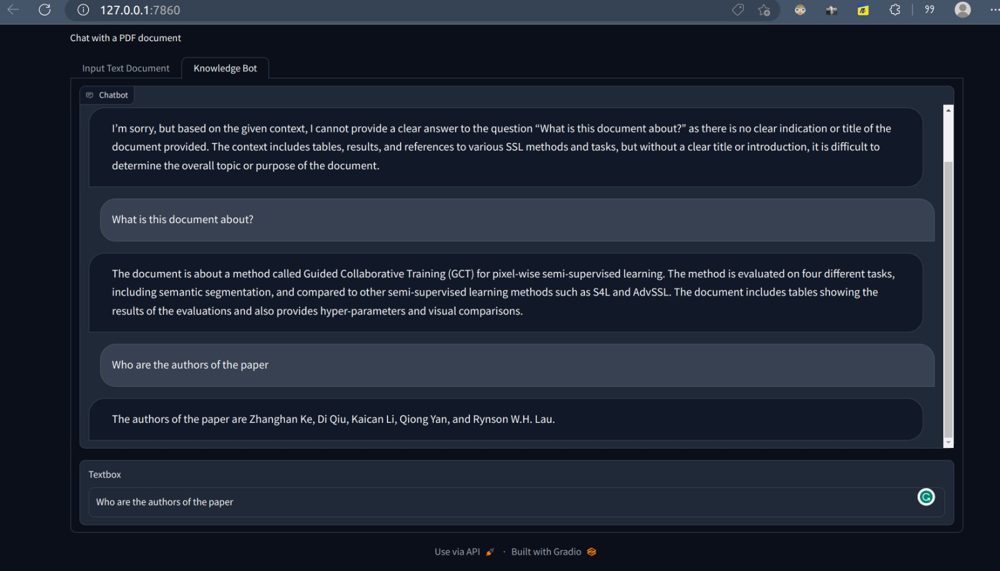

# chatPDF

Chat with any PDF using GPT3.5-turbo, faiss vector database and InstructorEmbedding. Uses around 3GB of GPU VRAM for the InstructorEmbedding model.

## Installation

Tested on Ubuntu 22.04

- Create a new conda env `conda create -n chatpdf python=3.9 -y`
- Activate the conda env `conda activate chatpdf`
- Install required packages `pip install -r requirements.txt`
- Install faiss vector database `conda install -c conda-forge faiss-gpu`
- Create a OpenAI account and get a OPENAI_API_KEY

## Launch the gradio interface

`python chat.py`

## FAQ

Q) Why not use LangChain
A) Too abstract for me

Q) Why not use OpenAI Embeddings
A) Please feel free to create a pull request to add support for it. I wanted to keep the project entirely open source but ultimately couldn't resist using GPT3.5-turbo

## ToDo

- [ ] Add support for other embeddings, chat models
- [ ] Improve the Prompts
- [ ] Show streaming response from GPT3.5-turbo

## Acknowledgements

This code is based on two similar projects
- https://github.com/mayooear/gpt4-pdf-chatbot-langchain
- https://github.com/amrrs/LLM-QA-Bot